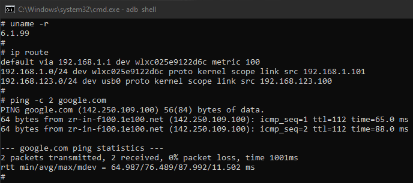

Luckfox Lyra - плата для розробки на базі процесора RK3506G2. 
На платі відсутній модуль WiFi, але виведено роз'єм для підключення USB-пристроїв, до якого можна підключити USB-WiFi-адаптер.
В цьому репозиторії знаходяться бінарні файли драйверів та прошивок для чіпів деяких WiFi-адаптерів. В стандартній ОС(Ubuntu) з сайту виробника ці драйвери відсутні, а в драйварах, що постачаються в наборі з SDK є проблеми з сумісністю.

Вихідні коди драйверів взято з репозиторіїв: 
    https://github.com/lwfinger/rtl8188eu
    https://github.com/lwfinger/rtl8723bu
    https://github.com/kelebek333/rtl8188fu

# Інструкція зі встановлення та налаштування

Інструкція складена з використанням прошивки Ubuntu_Luckfox_Lyra_MicroSD_250417.
На Buildroot через відсутність пакетного менеджера, є проблеми зі збіркою/встановленням утиліт, для роботи з WiFi-адаптером.

### Додавання мережі на плату
Першим кроком на плату Luckfox Lyra необхідно протягнути мережу інтернет з ПК(хоста) по USB для завантаження утиліт. 

Після того, як плата завантажилась і запустила ADB, потрібно видати їй статичну адресу, яка буде прив'язуватися до імені пристрою, в даному випадку lyra0. MAC-адреса та ім'я інтерфейсу динамічні, тому не можуть бути використані для досягнення мети.

# НА ХОСТІ

Додати ім'я пристрою.
------------------

Дані idVendor, idProduct беруться з детальної інформацї usb-пристрою. В теорії вони однакові для всіх плат Luckfox Lyra. ATTRS{serial} в теорії не важливий.

    lsusb
> Bus 003 Device 030: ID 2207:0019 Fuzhou Rockchip Electronics Company rk3xxx

З цього рядка беремо:
idVendor: 2207
idProduct: 0019

Далі потрібно подивитися серійний номер через udevadm info. Для цього виконуємо:

    udevadm info -a -p /sys/bus/usb/devices/3-30

Тут 3-30 — (Bus 003 Device 030). У виводі шукаємо рядок:
ATTR{serial}=="<серійний номер>"

    sudo nano /etc/udev/rules.d/99-lyra.rules

Вміст:

    SUBSYSTEM=="net", ACTION=="add", ATTRS{idVendor}=="2207", ATTRS{idProduct}=="0019", ATTRS{serial}=="2a9dfd2363bcabd0", NAME="lyra0"

------------------

Перезавантажити udevadm control

    sudo udevadm control --reload
    sudo udevadm trigger

------------------

Перевірити підключення

    ip addr show lyra0

Ввиведе дані інтерфейс без статичної IP-адреси. ЇЇ потрібно додати далі.

------------------

Увімкнути systemd-networkd

    sudo systemctl enable systemd-networkd
    sudo systemctl start systemd-networkd

Додати IP-адресу пристрою
------------------

    sudo nano /etc/systemd/network/10-lyra0.network 

Вміст:

    [Match]
    Name=lyra0

    [Network]
    Address=192.168.123.1/24

------------------

Перезапустити службу:

    sudo systemctl restart systemd-networkd

------------------

Перевірити наявність IP-адреси:

    ip addr show lyra0

------------------

Якщо статична адреса злетіла в майбутньому на хості, виконати:

    sudo systemctl restart systemd-networkd

------------------

Якщо мережа на плату буде підключена завжди тільки через Хост, є сенс в налаштуваннях мережевих з'єднань на Хості в lyra0 через GUI увімкнути пункт "З'єднуватись автоматично".

------------------

Протягування мережі інтернет з хоста на Lyra
------------------

Після закріплення адреси за пристроєм протягуємо на нього інтернет з хоста.

------------------

Увімкнути пересилання IP-пакетів.

    sudo sysctl -w net.ipv4.ip_forward=1

------------------

Додати правило.

    sudo nano /etc/sysctl.conf

Вміст:
    
    net.ipv4.ip_forward=1

------------------

Оновити правила.

    sudo sysctl -p

------------------

Додати правила.

    sudo nft add table ip nat
    sudo nft 'add chain ip nat POSTROUTING { type nat hook postrouting priority 100; }'
    sudo nft add rule ip nat POSTROUTING oif "wlp1s0" masquerade

Де wlp1s0 — інтерфейс на якому на хості є підключення до мережі.

------------------

Додати фільтрацію.

    sudo nft add table ip filter
    sudo nft 'add chain ip filter FORWARD { type filter hook forward priority 0; policy drop; }'
    sudo nft add rule ip filter FORWARD iif "lyra0" oif "wlp1s0" accept
    sudo nft add rule ip filter FORWARD iif "wlp1s0" oif "lyra0" ct state related established accept

------------------

Закріпити правила. В теорії повинно працювати постійно, але злітає регулярно. Можливо є є кращі рішення, але для нас це не важливо, тому що інтернет протягувати протрібно буде тільки один раз.

    sudo sh -c "nft list ruleset > /etc/nftables.conf"
    sudo systemctl enable nftables
    sudo systemctl start nftables

------------------

Перегляд активних правил.

    sudo nft list ruleset

Повинно вивести 

    table ip nat {
        chain POSTROUTING {
            type nat hook postrouting priority 100; policy accept;
            oif "wlp1s0" masquerade
        }
    }

    table ip filter {
        chain FORWARD {
            type filter hook forward priority 0; policy drop;
            iif "lyra0" oif "wlp1s0" accept
            iif "wlp1s0" oif "lyra0" ct state related,established accept
        }
    }

------------------

Якщо було раніше встановлено неробочі драйвери, підключитись до плати та видалити їх.
Шлях потрібно вказати свій.

    rmmod 8188eu
    rm /lib/modules/6.1.99/extra/8188eu.ko
    rm /lib/modules/6.1.99/extra/rtl8188eufw.bin

    rmmod rtl8723bu
    rm /lib/modules/6.1.99/extra/rtl8723bu.ko
    rm /lib/firmware/rtlwifi/rtl8723b_fw.bin
    rm /lib/firmware/rtlwifi/rtl8723bu_ap_wowlan.bin
    rm /lib/firmware/rtlwifi/rtl8723bu_bt.bin
    rm /lib/firmware/rtlwifi/rtl8723bu_nic.bin
    rm /lib/firmware/rtlwifi/rtl8723bu_wowlan.bin

------------------

Завантажити з хоста по ADB файли драйвера та прошивки адаптера, що знаходяться в архівах.

Для 8188eu

    adb push 8188eu.ko /lib/modules/6.1.99/extra
    adb push rtl8188eufw.bin /lib/firmware/rtlwifi/

Для rtl8723bu

    adb push 8723bu.ko /lib/modules/6.1.99/extra
    adb push rtl8723b_fw.bin /lib/firmware/rtlwifi/
    adb push rtl8723bu_ap_wowlan.bin /lib/firmware/rtlwifi/
    adb push rtl8723bu_bt.bin /lib/firmware/rtlwifi/
    adb push rtl8723bu_nic.bin /lib/firmware/rtlwifi/
    adb push rtl8723bu_wowlan.bin /lib/firmware/rtlwifi/

Для 8188fu/ftv

    adb push 8188fu.ko /lib/modules/6.1.99/extra
    adb push rtl8188fufw.bin /lib/firmware/rtlwifi/

------------------

Підключитись до плати

    adb shell

------------------
 

# НА ПЛАТІ LYRA

Cтворити маршрут:

    nano /etc/systemd/network/10-usb0.network

Вміст:

    [Match]
    Name=usb0

    [Network]
    Address=192.168.123.100/24
    Gateway=192.168.123.1
    DNS=8.8.8.8
    Name=usb0

------------------

Увімкнути/перезавантажити systemctl

    systemctl enable systemd-networkd
    systemctl restart systemd-networkd

------------------

Налаштувати DNS на платі.

    nano /etc/resolv.conf:

Видалити все та вставити наступне: 

    nameserver 8.8.8.8
    nameserver 8.8.4.4

------------------

Перевірити з'єднання з інтернет.

    ping -c 4 8.8.8.8

Якщо відповіді приходять  NAT працює

------------------

Перевірити DNS:

    ping -c 4 google.com

------------------

 

# Встановлення та налаштування драйверів

Після підключення мережі на платі потрібно виконати оновлення системи та завантажити інструменти для керування WiFi-адаптером.

    apt update
    apt upgrade
    apt install iw wpasupplicant net-tools

------------------

Завантажити вручну відповідний драйвер для перевірки.

    insmod /lib/modules/6.1.99/extra/8188eu.ko
    insmod /lib/modules/6.1.99/extra/8723bu.ko

------------------

Перевірити стан інтерфейсів

    lsmod | grep 8188eu
    lsmod | grep 8723bu

    ip a

------------------

Додати автоматичне завантаження відповідного драйвера.

    echo "8188eu" | tee -a /etc/modules
    echo "8723bu" | tee -a /etc/modules

------------------

Оновити список модулів

    depmod -a

------------------

Перезавантажити плату.

    reboot

------------------

Отримати інформацію про доступні інтерфейси.

    ifconfig

Знайти інтерфейс WiFi-адаптера. Зазвичай починається з wl*.

------------------

Увімкнути WiFi-адаптер вручну.

    ip link set wlxc025e9122d6c up #Tp-Link
    ip link set wlx38a38c80c502 up

------------------

Перевірити інтерфейс.

    ifconfig 

Стан інтерфейсу повинен змінитися на UP.

------------------

Сканувати точки доступу.
    
    iwlist wlxc025e9122d6c scan #Tp-Link
    iwlist wlx38a38c80c502 scan

Де wlxc025e9122d6c - ім'я інтерфейсу.

------------------

Згенерувати ключі

    wpa_passphrase ВАШ_SSID "Ваш_пароль"

Отримуємо:

    network={
        ssid="ВАШ_SSID"
        psk=ВАШ_PSK
    }

------------------

Створити файл підключення(універсальний для всіх драйверів).

    nano /etc/wpa_supplicant.conf

Вміст:

    ctrl_interface=/var/run/wpa_supplicant
    ctrl_interface_group=0
    update_config=1

    network={
        ssid="Ваш_SSID"
        psk=ВАШ_PSK
        key_mgmt=WPA-PSK
    } 

------------------

Відключити network-manager задля уникнення конфліктів.

    service network-manager stop

------------------

Відредадагувати файл:

    nano /etc/systemd/network/10-usb0.network   

Вміст:

    [Match]
    Name=usb0

    [Network]
    Address=192.168.123.100/24
    #Gateway=192.168.123.1 Більше не потрібно протягувати інтернет по USB.
    DNS=8.8.8.8
    Name=usb0

------------------

Вручну підключитися до точки доступу.

    #rtl8188eu Працює тільки в режимі з підтримкою старого інтефрейсу налаштування.
    wpa_supplicant -B -i wlxc025e9122d6c -c /etc/wpa_supplicant.conf -D wext
    dhclient wlxc025e9122d6c

    #rtl8723bu не потребує -D wext
    wpa_supplicant -B -i wlx38a38c80c502 -c /etc/wpa_supplicant.conf
    dhclient wlx38a38c80c502

------------------

Налаштувати мережеві інтерфейси для автоматичного увімкнення WiFi-адаптера та
підключення до точки доступу.

    nano /etc/network/interfaces

Вміст:

    #rtl8188eu
    auto wlxc025e9122d6c
    iface wlxc025e9122d6c inet dhcp
        wpa-conf /etc/wpa_supplicant.conf
        metric 100  
        wpa-driver wext

    #rtl8723bu
    auto wlx38a38c80c502
    iface wlx38a38c80c502 inet dhcp
        wpa-conf /etc/wpa_supplicant.conf
        metric 110 
        # НЕ ДОДАВАТИ: wpa-driver. Використовує nl80211.

    #rtl8188fu_ftv
    auto wlx002e2d209097
    iface wlx002e2d209097 inet dhcp
        wpa-conf /etc/wpa_supplicant.conf
        metric 120
        # НЕ ДОДАВАТИ: wpa-driver. Використовує nl80211. 

    auto usb0
    iface usb0 inet static
        address 192.168.123.100
        netmask 255.255.255.0
        metric 200 

Де wlxc025e9122d6c - вказати імена реальних інтерфейсів.
    
------------------

Перезавантажити систему та переконатися, що мережа інтернет доступна на платі Lyra.

    ping -c 4 8.8.8.8
    ping -c 4 google.com

------------------

Деякі адаптери не стартують миттєво, та потребують певного часу для завантаження.

------------------

Нагадування для збірки інших драйверів.

    make ARCH=arm CROSS_COMPILE=arm-none-linux-gnueabihf- \
        KSRC=/mnt/D/sbc/luckfox/lyra-sdk/kernel-6.1

Для збірки драйвера, написаного під старіше ядро Linux.

    EXTRA_CFLAGS += -Wno-error
    EXTRA_CFLAGS += -Dcomplete_and_exit=kthread_complete_and_exit
    EXTRA_CFLAGS += -Wno-unused-variable
     
